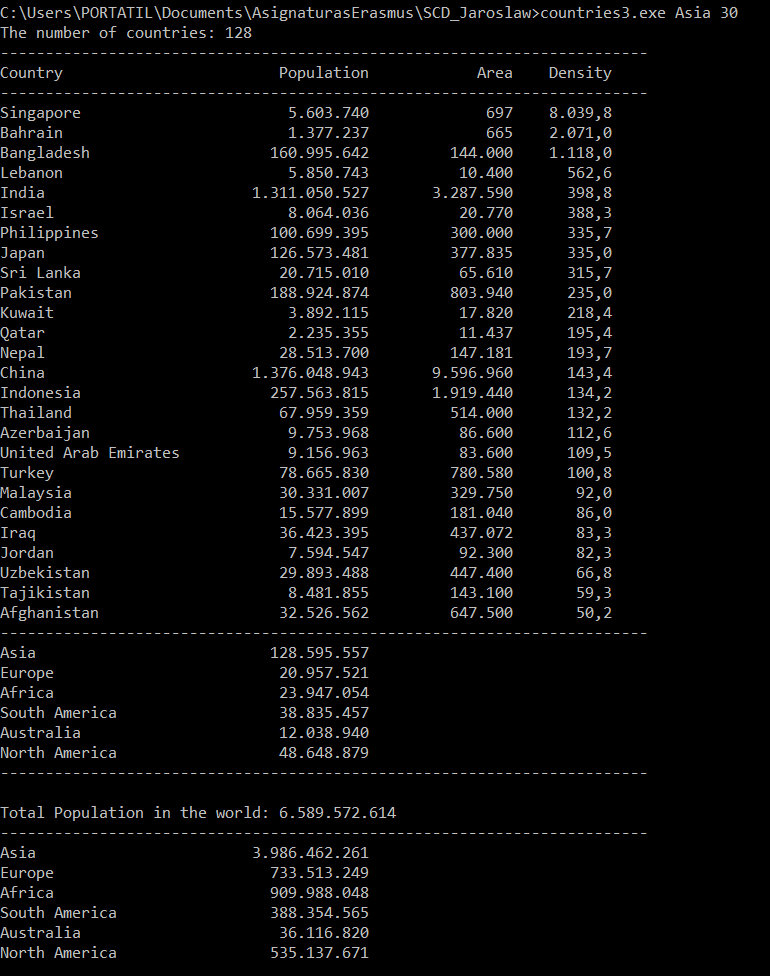

 # LINQ Queries with a file information (C#)

 ### Version 1: countries.cs 

 > countries.exe   continent_name

 > This program obtain the Data Base from a file 
named data.csv and keep this information in IEnumerable<Country> Countries. 
After this the program does a LINQ Query where show the countries with density higher to 100 of a 
Continent (that we add like first parameter). Finally this program show the total of Countries 
that pass this condition instead of this Continent, and information about this Counties 
like Name of the country, Population of this country, Area and Density

 #### Step 1: create the data source, this time from a file data.csv
```c#
 IEnumerable<Country> Countries = GetCountries();
```
```c#
 public static IEnumerable<Country> GetCountries()
    {
        var countries = System.IO.File.ReadAllLines("data.csv");
 
		
        return (from line in countries
                let fields = line.Split(',')
                
                select new Country()
                {
                    Name = fields[0].Trim(),
                    Continent = fields[1].Trim(),
                    Population = Convert.ToInt32(fields[2]),
                    Area = Convert.ToInt32(fields[3].Trim()),	
                    Gdp2010 = Convert.ToDouble(fields[6].Trim())
                });
               
    }
```
 #### Step 2: Query creation:

 > This query take the countries (from the 
Continent that we choise) with density higher than 
100 and order the countries by descending density 

```c#
 var result = from c in Countries
            where (c.Continent == theContinent) && (c.Population / c.Area > 100)
            orderby c.Population/c.Area descending
            select c;
```
 #### Step 3: Query execution 

 > Show the Name of the country, Population of this country, Area and Density

```c#
foreach(Country c in result){
            Console.WriteLine(String.Format("{0, -25} {1, 15:n0} {2, 15:n0} {3, 10:n1}", c.Name, c.Population, c.Area, (1.0*c.Population/c.Area)));
        }  
```
 #### Output countries.cs

 


 ### Version 2: countries2.cs

 > countries.exe   continent_name   density

 >This program obtain the Data Base from a file named data.csv and keep this information in IEnumerable<Country> Countries.
After this the program does a LINQ Query where show the countries with density higher to <density> of a 
Continent (that we add like first parameter <continent name>).
Finally this program show the total of Countries that pass this condition instead of this 
Continent, and information about this Counties like Name of the country, Population of this 
country, Area and Density


 #### Step 1: create the data source, this time from a file
 
 > Same than Version 1

 #### Step 2: Query creation:

 > This query take the countries (from the Continent
 that we choise) with density higher than <density> and order the countries by descending density

```c#
 var result = from c in Countries
            where (c.Continent == theContinent) && (c.Population / c.Area > theDensity)
            orderby c.Population/c.Area descending
            select c;
```
 #### Step 3: Query execution

 > Show the Name of the country, Population of this
 country, Area and Density
```c#
 foreach(Country c in result){
            Console.WriteLine(String.Format("{0, -25} {1, 15:n0} {2, 15:n0} {3, 10:n1}", c.Name, c.Population, c.Area, (1.0*c.Population/c.Area)));
        }  
```
 #### Output countries2.cs

  

 
  ### Version 3: countries3.cs

 > countries.exe   continent_name   density

 > This program obtain the Data Base from a file 
named data.csv and keep this information in 
IEnumerable Countries. After this the program does 
a LINQ Query where show the countries with density 
higher to of a Continent (that we add like first 
parameter ). Finally this program show the total 
of Countries that pass this condition instead of 
this Continent, and information about this 
Counties like Name of the country, Population of 
this country, Area and Density

 #### Step 1: create the data source, this time from a file

 > Same than Version 1

 #### Step 2 : Query creation:

 > This query take the countries (from the 
Continent that we choise) with density higher than and order 
the countries by descending density

```c#
var result = from c in Countries
            where (c.Continent == theContinent) && 
(c.Population / c.Area > theDensity)
            orderby c.Population/c.Area descending
            select c;
```

 > This query take the coustries and do a 
group by continent calculating the average of the 
population of this continent

```c#
 var result1 = from c in Countries
                      group c by c.Continent into groups
                      select new
                      {
                          Continent = groups.Key,
                          AveragePopulation = groups.Average(c => c.Population),
                      };
```
 > This query take all the countries
```c#
 var result2 = from c in Countries
                      select c;
```
  > This query take the coustries and do a
group by continent calculating the TotalPopulation 
of the population of this continent 
```c#
 var result3 = from c in Countries
                      group c by c.Continent into groups
                      select new
                      {
                          Continent = groups.Key,
                          TotalPopulation = groups.Sum(c => c.Population),
                      };
```
 #### Step 3: Query execution

 > Show the Name of the country, Population of this country, Area and Density

```c#
 foreach(Country c in result){
            Console.WriteLine(String.Format("{0, -25} {1,$
        }
```
 > Show the average population of each continent

```c#
 foreach (var f in result1)
        {
            Console.WriteLine("{0, -25} {1, 15:n0}", f.Continent, f.AveragePopulation);

        }
```
 > Show the total population in the world

```c#
foreach (Country c in result2)
        {
            total += c.Population;
        }
```

  > Show the toal population by continent

```c#
 foreach (var f in result3)
        {
            Console.WriteLine("{0, -25} {1, 15:n0}", f.Continent, f.TotalPopulation);
        }
```

 #### Output countries3.cs

  
