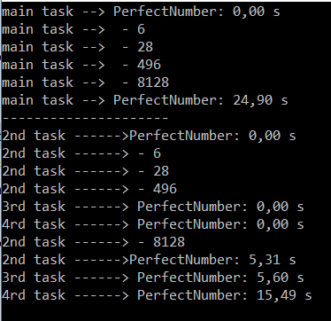

 # Tasks (C#)
 ###  It is created on the thread pool which has already system created threads to improve the performance.
 ####  Creating main thread
```c#
//main thread
        GoPerfect(2, 80000, "main task --> ");
```
 #### Creating tasks
```c#
Task task2 = new Task(() => GoPerfect(2, 35000, "2nd task ------>"));
        task2.Start();


        //Thread tak3 = new Thread(() => GoPerfect(35001, 80000, "3rd thread ------> "));
        Task task3 = new Task(() => GoPerfect(35001, 50000, "3rd task ------> "));
        task3.Start();

        Task task4 = new Task(() => GoPerfect(50001, 80000, "4rd task ------> "));
        task4.Start();
````
 ###  Output Task_PerfectNumber.cs
 > The time is smaller if we use task in this 
example.


