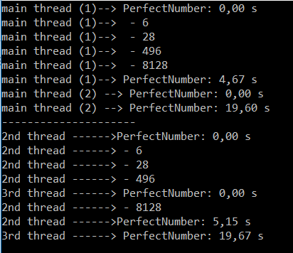

 # Threads (C#)
 ###  A thread is an independent execution path, able to run simultaneously with other threads.
 ####  Creating main threads 
```c#
//main threads
        GoPerfect(2, 35000, "main thread (1)--> 
");
        GoPerfect(35001, 80000, "main thread (2) 
--> ");
```
 #### Creating new threads
```c#
//Call GoPerfect() on a new thread
        Thread task2 = new Thread(() => GoPerfect(2, 35000, "2nd thread ------>"));
        task2.Start();

        //Call GoPerfect() on a new thread
        Thread task3 = new Thread(() => GoPerfect(35001, 80000, "3rd thread ------> "));
        task3.Start();
````
 ###  Output Threads_PerfectNumber.cs
> The time of the main threads have to be add for 
know the total time that main needed for the 
operation. The time of the other threads need to 
do the operation is the last time printed.

