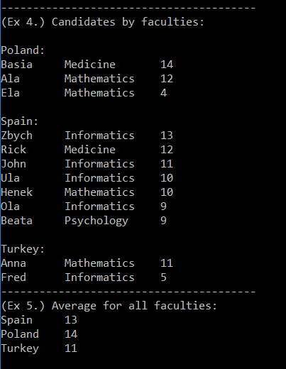

 # LINQ Queries (C#)
 ### All LINQ query operations consist of three distinct actions:
 > 1. Data source:
```c#
List<Student> students = new List<Student>() {
                new Student() { Country = "Spain", Name = "Zbych", Marks = 13, Faculty = "Informatics"} ,
                new Student() { Country = "Spain", Name = "John", Marks = 11, Faculty = "Informatics"} ,
                new Student() { Country = "Poland", Name = "Ala", Marks = 12, Faculty = "Mathematics" } ,
                new Student() { Country = "Spain", Name = "Ola", Marks = 9, Faculty = "Informatics" } ,
                new Student() { Country = "Poland", Name = "Ela", Marks = 4, Faculty = "Mathematics"} ,
                new Student() { Country = "Spain", Name = "Ula", Marks = 10, Faculty = "Informatics" },
                new Student() { Country = "Spain", Name = "Rick", Marks = 12, Faculty = "Medicine" },
                new Student() { Country = "Spain", Name = "Henek", Marks = 10, Faculty = "Mathematics" },
                new Student() { Country = "Poland", Name = "Basia", Marks = 14, Faculty = "Medicine" },
                new Student() { Country = "Turkey", Name = "Anna", Marks = 11, Faculty = "Mathematics" },
                new Student() { Country = "Turkey", Name = "Fred", Marks = 5, Faculty = "Informatics" },
                new Student() { Country = "Spain", Name = "Beata", Marks = 9, Faculty = "Psychology" }
            };
```
 > 2. Query creation:
```c#
var result2 = from s in students
                          //where s.Marks > 11
                      orderby s.Country, s.Marks descending
                      group s by s.Country;
```
```c#
var result3 =
            from s in students
            group s by s.Country into groups

            select new
            {
                Country = groups.Key,
                AverageMarks = groups.Max(s => s.Marks),
            };
```
 > 3. Query execution:
```c#
foreach (var country in result2)
        {
            Console.WriteLine("");
            Console.WriteLine("{0}:", country.Key); //Each group has a key 


            foreach (Student s in country) // Each group has inner collection
                Console.WriteLine("{0} \t  {1} \t {2}", s.Name, s.Faculty, s.Marks);
        }
```
```c#
foreach (var f in result3)
        {
            Console.WriteLine("{0} \t  {1}", f.Country, f.AverageMarks);
        }
```
 ### Output LINQ_4.cs

