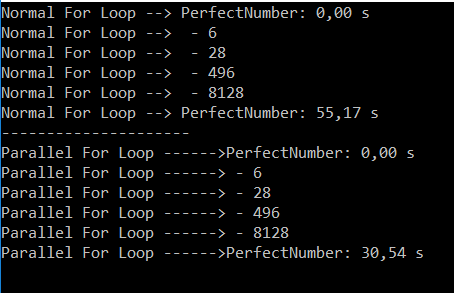

 # Parallel For of Perfect Number (C#)
 ###  You write the loop logic for a Parallel.For as you would write a sequential loop.
 ####  This program calculate the operaton Perfect Number  in a Normal For Loop and in Parallel For Loop
 ####  Operation in Normal For Loop
```c#
//main threads
        GoPerfect(2, 120000, "Normal For Loop --> ");
```
 #### Operation in Parallel For Loop
```c#
 GoPerfectParallel(2, 120000, "Parallel For Loop ------>");
```
 #### Parallel Funcion
 >  it uses the Parallel.For method to add only 
the numbers wich divided by another number the 
result is 0, in parallel operations.
```c#
static bool PerfectNumbersParallel(long n)
    {
        long s = 0;
        long m = n / 2 + 1;
        Parallel.For(1, m, i =>
        {
            if (n % i == 0)
            {
                s += i;
            }
        });

        if (n == s) return true;
        else return false;
    }
```
 #### Secuencial Function
```c#
static bool PerfectNumbers(long n)
    {
        long s = 0;
        for (int i = 1; i <= n / 2 + 1; i++)
        {
            if (n % i == 0)
            {
                s += i;
            }
        }
        if (n == s) return true;
        else return false;
    }
```
  
 #### Output ParallelFor_PerfectNumer.cs

 > In the output we can see that of course 
Parallel For need less time to calculate the 
Perfect number, almost the half of the time that 
the normal for


