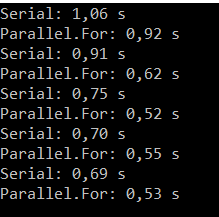

* LINQ_4.cs  LINQ Query
The following example shows how the three 
parts of a query operation are expressed 
in source code. The example uses a 
collection Student as a data source.

* PerfectNumber.cs with parallel for
*
*
* Program3threads.cs multithreads
* ForLoop.cs
*countries.cs 
```c#
var result = from c in Countries
            where (c.Continent == 
theContinent) && (c.Population / c.Area > 
theDensity)
            orderby c.Population/c.Area 
descending
            select c;
```


